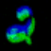
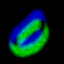
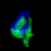
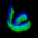
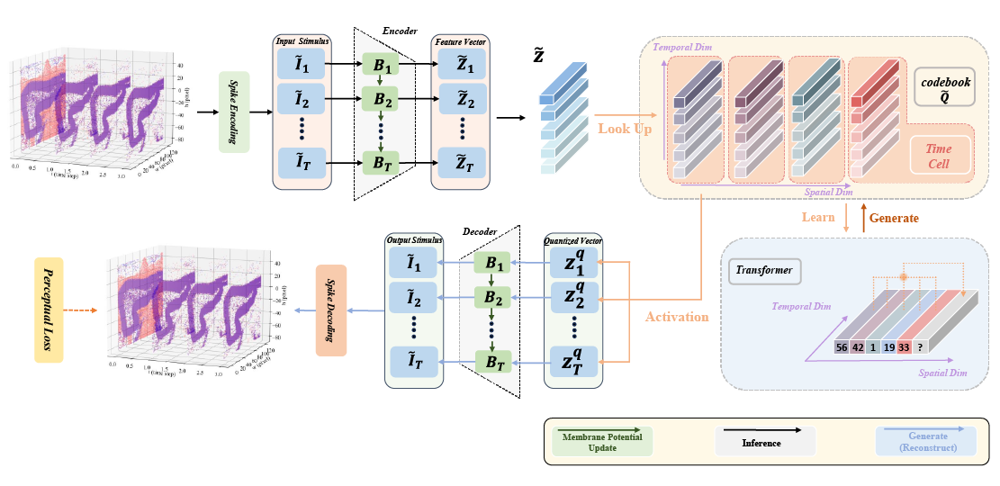
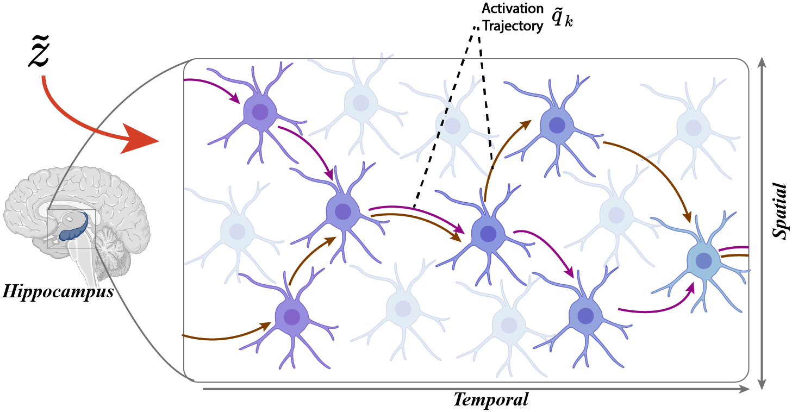
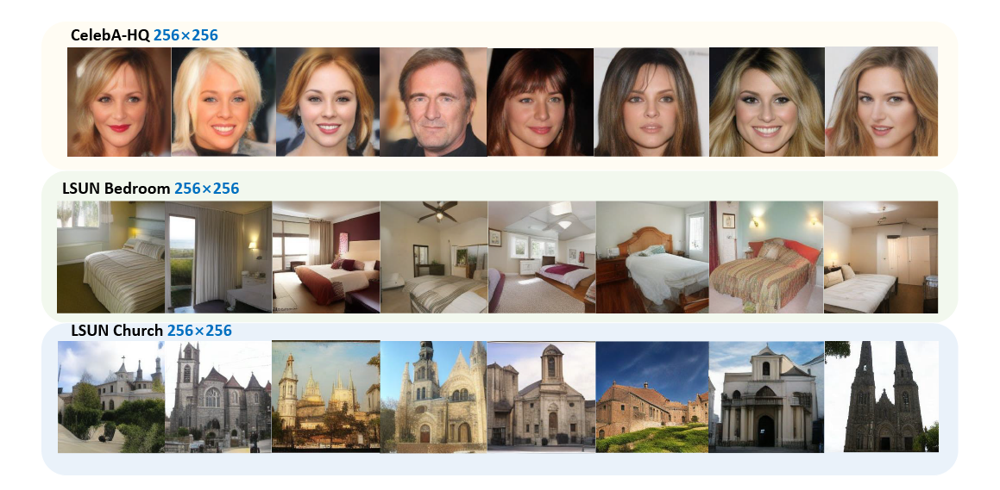
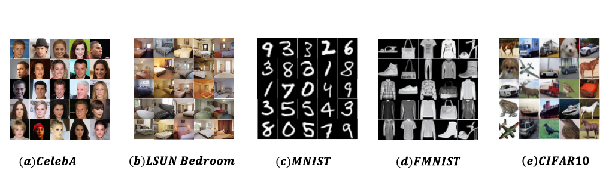
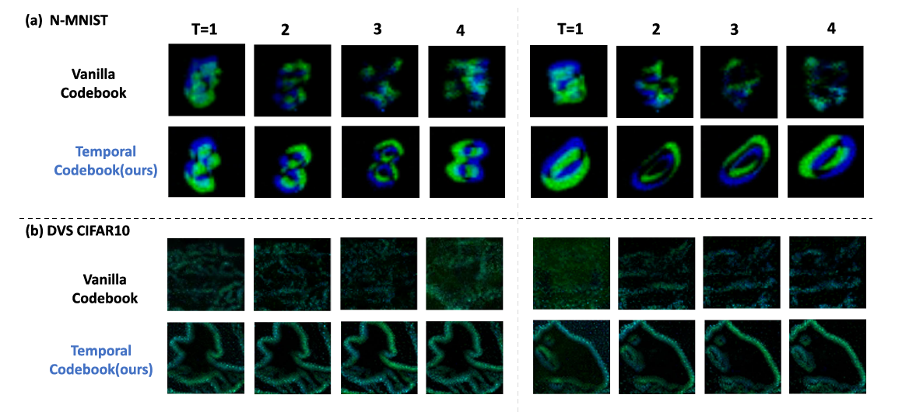

# Time Cell Inspired Temporal Codebook in Spiking Neural Networks for Enhanced Image Generation

[](https://arxiv.org/abs/2405.14474)
[](https://github.com/BrainCog-X/Brain-Cog)


**This is the official implementation of "Time Cell Inspired Temporal Codebook in Spiking Neural Networks for Enhanced Image Generation". The GIFs above show the generated event-based NMNIST data**

<p align="center">
  
  
  
  
  
</p>

## Table of Contents

- [Time Cell Inspired Temporal Codebook in Spiking Neural Networks for Enhanced Image Generation](#time-cell-inspired-temporal-codebook-in-spiking-neural-networks-for-enhanced-image-generation)
  - [Table of Contents](#table-of-contents)
  - [Introduction](#introduction)
  - [SetUp](#setup)
  - [Data](#data)
  - [Training](#training)
    - [Default Run](#default-run)
    - [Custom Run and Config](#custom-run-and-config)
  - [Sample](#sample)
    - [Script](#script)
    - [Results](#results)
  - [Model Architecture](#model-architecture)
    - [Overall Architecture](#overall-architecture)
    - [Encoder and Decoder Architectures](#encoder-and-decoder-architectures)
      - [Table: Encoder Architecture](#table-encoder-architecture)
      - [Table: Decoder Architecture](#table-decoder-architecture)
      - [Table: ResnetBlockSnn Architecture](#table-resnetblocksnn-architecture)
      - [Table: Overall Architecture Summary](#table-overall-architecture-summary)
    - [Experiments Details](#experiments-details)
      - [Table: Configuration for Experiments](#table-configuration-for-experiments)
  - [Acknowledgement](#acknowledgement)
  - [BibTeX](#bibtex)
  - [To-Do](#to-do)
  

## Introduction
This paper presents a novel approach leveraging Spiking Neural Networks (SNNs) to construct a Variational Quantized Autoencoder (VQ-VAE) with a temporal codebook inspired by hippocampal time cells. This design captures and utilizes temporal dependencies, significantly enhancing the generative capabilities of SNNs. Neuroscientific research has identified hippocampal "time cells" that fire sequentially during temporally structured experiences. Our temporal codebook emulates this behavior by triggering the activation of time cell populations based on similarity measures as input stimuli pass through it. We conducted extensive experiments on standard benchmark datasets, including MNIST, FashionMNIST, CIFAR10, CelebA, and downsampled LSUN Bedroom, to validate our model's performance. Furthermore, we evaluated the effectiveness of the temporal codebook on neuromorphic datasets NMNIST and DVS-CIFAR10, and demonstrated the model's capability with high-resolution datasets such as CelebA-HQ, LSUN Bedroom, and LSUN Church. The experimental results indicate that our method consistently outperforms existing SNN-based generative models across multiple datasets, achieving state-of-the-art performance. Notably, our approach excels in generating high-resolution and temporally consistent data, underscoring the crucial role of temporal information in SNN-based generative modeling.

The overview of proposed method is as follows:

<p align="center">
  
</p>

The activation of temporal codebook represents a spatiotemporal trajectory, akin to the activation of time cells, as illustrated below:

<p align="center">
  
</p>


## SetUp
We use 4 x A100 40G to train proposed model.
```
git clone git@github.com:Brain-Cog-Lab/tts_vqvae.git
cd tts_vqvae
pip install -r requirements.txt
```

## Data
- **LSUN bedroom**: We use only [20% of LSUN bedroom](https://www.kaggle.com/datasets/jhoward/lsun_bedroom)
- **CelebA**: From torchvison [interface](https://pytorch.org/vision/main/generated/torchvision.datasets.CelebA.html)
- **NMNIST**: From [BrainCog](https://github.com/BrainCog-X/Brain-Cog)


## Training

### Default Run

- First stage of LSUN Bedroom
```
chmod +x ./train/stage_1/run_snn_te_bedroom.sh
./train/stage_1/run_snn_te_bedroom.sh
```

- First stage of Celeba
```
chmod +x ./train/stage_1/run_snn_te_celeba.sh
./train/stage_1/run_snn_te_celeba.sh
```

- First stage of NMNIST
```
chmod +x ./train/stage_1/run_snn_te_nmnist.sh
./train/stage_1/run_snn_te_nmnist.sh
```

- Second stage of LSUN Bedroom
```
chmod +x ./train/stage_2/run_snn_transformer_bedroom.sh
./train/stage_2/run_snn_transformer_bedroom.sh
```

- Second stage of CelebA
```
chmod +x ./train/stage_2/run_snn_transformer_celeba.sh
./train/stage_2/run_snn_transformer_celeba.sh
```

- Second stage of NMNIST
```
chmod +x ./train/stage_2/run_snn_transformer_nmnist.sh
./train/stage_2/run_snn_transformer_nmnist.sh
```

### Custom Run and Config
For custom run, you need to modify **.yaml** from **./train** folder. We take **./train/stage_1/snn_te_bedroom.yaml** for example.

This part is the config of meta information, including experiment name, index, seed etc. You could change seed and determine whether resume from checkpoint or not.
```
exp:

  # identifier
  name: snn_te
  index: 'bedroom_256'

  # resume
  is_resume: False
  resume_path: res/snn_te/2/ckpt/last.ckpt

  # seed
  seed: 42
```

This part is the information of model. 
```
model:
  base_learning_rate: 4.5e-6
  target: src.registry.model_registry.snnte_lsunbed
  params:
    # snn setting
    snn_encoder: direct
    snn_decoder: mean
    ...
    ...
    ...
```

This part determines how to load data, please ref to [LightningDataModule](https://lightning.ai/docs/pytorch/stable/data/datamodule.html)
```
data:
  target: src.data.data_module.DataModuleFromConfig
  params:
    batch_size: 4
    num_workers: 8
    train:
      target: src.registry.data_registry.lsun_bedroom_256_20_key
      params:
        data_root: "../dataset/lsun_bedroom_0.2"
        split: full
```

This part is the config of pytorch-lightning, please ref to [LightningTrainer](https://lightning.ai/docs/pytorch/stable/common/trainer.html), [LightningCallbacks](https://lightning.ai/docs/pytorch/stable/extensions/callbacks.html), and [LightningLogging](https://lightning.ai/docs/pytorch/stable/extensions/logging.html).
```
lightning:
  trainer:
    # multigpus settings
    accelerator: 'gpu'
    strategy: 'ddp_find_unused_parameters_true'
    devices: [0,1,2,3]

    # precision, options: 32-true, 16-mixed etc.
    precision: "32-true"
  ...
  ...
  ...
``` 

## Sample
### Script
Sample on static image
```
chmod +x ./sample/run_sample_static.sh
./sample/run_sample_static.sh
```

Sample on event-based data
```
chmod +x ./sample/run_sample_event.sh
./sample/run_sample_event.sh
```

Custom sample config, in **.yaml** of **./sample**
```
sampler:
  target: src.sample.BaseSampler
  params:
    gen_config_path: train/stage_2/snn_transformer_nmnist.yaml
    gen_ckpt_path: res/snn_transformer/nmnist/ckpt/epoch=99-step=46900.ckpt
    batch_size: 64
    code_h: 4
    code_w: 4
    verbose_time: False


sample_params:
  num_samples: 100
  temperature: 1.0
  time_unfold: false
```

Here are some explanations for config above:
- **gen_config_path** is .yaml config of second stage model.
- **gen_ckpt_path** is checkpoint path of second stage model.
- **code_h/code_w** is codebook size, equal to resolution/16
- **time_unfold** determines whether to unfold event data across time step.

### Results

Generated images of resolution $256 \times 256$.



Generated images of resolution $64 \times 64$.



Unfold generated event data, comparing our temporal codebook with vanilla codebook.




## Model Architecture

### Overall Architecture

We provide a comprehensive overview of the proposed temporal VQ-VAE architecture in the table below (Table: Overall Architecture Summary). The **Stage** column represents the abstract stages of information processing, ordered sequentially from lower to higher indices. The **Component** and **Class** columns specify the attribute names and corresponding classes (typically `nn.Module`) for each stage, corresponding to the code repository above. The **Description** column provides a textual explanation of each stage's functionality.

### Encoder and Decoder Architectures

This section provides a comprehensive description of the model architectures employed in the temporal VQ-VAE. The encoder architecture is detailed in the table below (Table: Encoder Architecture), while the decoder architecture is outlined in the table below (Table: Decoder Architecture). Both the encoder and decoder are constructed using the `ResnetBlockSnn` and `AttnBlockSnn` modules. The `AttnBlockSnn` module represents an attention mechanism implemented SNN, as described in [Li et al., 2022](#). The `ResnetBlockSnn` module adopts a ResNet-style architecture, with its configuration specified in the table below (Table: ResnetBlockSnn Architecture).

Within the `ResnetBlockSnn`, the **Main path** begins with a normalization step utilizing Group Norm, followed by the application of a LIF-Nonlinearity. (LIF-Nonlinearity is a nonlinear mapping composed of LIFNode, which is implemented as the input multiplied by the LIF output.) A 2D convolution is then performed with a kernel size of 3, a stride of 1, and padding of 1. This is succeeded by another LIF-Nonlinearity, incorporating time embedding addition, and a second Group Norm normalization, concluding with a final LIF-Nonlinearity. Concurrently, the **Shortcut path** employs a 2D convolution with a kernel size of either 1 or 3, depending on conditional requirements, and a stride of 1 with padding of 1. The output is obtained by summing the results of the Main path and the Shortcut path, thereby facilitating enhanced feature learning through incremental adjustments via the shortcut connection.

The encoder architecture, as presented in the table below (Table: Encoder Architecture), operates through a structured forward process. The **Input** stage initiates with a 2D convolution operation characterized by a kernel size of 3, a stride of 1, and padding of 1. This is followed by the **DownSample** stage, which incorporates \( N_{blocks} \) residual blocks (`ResnetBlockSnn`) and an attention block (`AttnBlockSnn`), concluding with a strided convolution for downsampling, executed once per level except in the last level. This sequence is repeated \( N_{res} \) times to achieve the desired resolution levels. The **Middle** stage then includes a series of operations: a `ResnetBlockSnn`, an `AttnBlockSnn`, another `ResnetBlockSnn`, and a normalization step using Group Norm, each performed once. The **Output** stage finalizes the process with a 2D convolution employing the same parameters (kernel size of 3, stride of 1, padding of 1) followed by Group Norm. This design efficiently processes the input across multiple resolution levels and residual connections, thereby enhancing feature extraction and representation.

The decoder architecture, as delineated in the table below (Table: Decoder Architecture), proceeds through a systematic forward process. The **Input** stage begins with a 2D convolution applied to the latent representation \( z \), executed once. This is followed by the **Middle** stage, which comprises a `ResnetBlockSnn`, an `AttnBlockSnn`, and a `ResnetBlockSnn`, each performed once. The **UpSample** stage then ensues, featuring a `ResnetBlockSnn` and an `AttnBlockSnn`, both repeated \( N_{blocks} + 1 \) times, followed by a transpose convolution for upsampling, iterated once per level except in the last level, with the entire sequence repeated \( N_{res} \) times across resolution levels. The **Output** stage concludes by applying a normalization step using Group Norm, an LIF node, and a 2D convolution to generate the output channels, each executed once. This architecture effectively reconstructs the output by progressively upsampling and refining the latent representation through multiple stages and residual connections.

---

#### Table: Encoder Architecture
**Caption**: **Encoder Architecture.** \( N_{res} \) is the number of resolution levels, and \( N_{blocks} \) is the number of residual blocks per level.

| **Stage**        | **Layers & Operations**            | **Repetitions**       |
| ---------------- | ---------------------------------- | --------------------- |
| **Input**        | `Conv2d` (k=3, s=1, p=1)           | 1                     |
| **DownSample**   | `ResnetBlockSnn`                   | \( N_{blocks} \)      |
|                  | `AttnBlockSnn`                     | \( N_{blocks} \)      |
|                  | `Downsample` (Strided convolution) | 1 (Not in last level) |
| **(DownSample)** | **× \( N_{res} \) DownSample**     |                       |
| **Middle**       | `ResnetBlockSnn`                   | 1                     |
|                  | `AttnBlockSnn`                     | 1                     |
|                  | `ResnetBlockSnn`                   | 1                     |
| **Output**       | `Normalize` (Group Norm)           | 1                     |
|                  | `LIFNode`                          | 1                     |
|                  | `Conv2d` (k=3, s=1, p=1)           | 1                     |

---

#### Table: Decoder Architecture
**Caption**: **Decoder Architecture.** \( N_{res} \) is the number of resolution levels, and \( N_{blocks} \) is the number of base residual blocks per level.

| **Stage**      | **Layers & Operations**             | **Repetitions**       |
| -------------- | ----------------------------------- | --------------------- |
| **Input**      | `Conv2d` (from latent \( z \))      | 1                     |
| **Middle**     | `ResnetBlockSnn`                    | 1                     |
|                | `AttnBlockSnn`                      | 1                     |
|                | `ResnetBlockSnn`                    | 1                     |
| **UpSample**   | `ResnetBlockSnn`                    | \( N_{blocks} + 1 \)  |
|                | `AttnBlockSnn`                      | \( N_{blocks} + 1 \)  |
|                | `Upsample` (Transpose convolution)  | 1 (Not in last level) |
| **(UpSample)** | **× \( N_{res} \) UpSample Stages** |                       |
| **Output**     | `Normalize` (Group Norm)            | 1                     |
|                | `LIFNode`                           | 1                     |
|                | `Conv2d` (to output channels)       | 1                     |

---

#### Table: ResnetBlockSnn Architecture
**Caption**: **ResnetBlockSnn Architecture.**

| **Path**     | **Layers & Operations**                       |
| ------------ | --------------------------------------------- |
| **Main**     | `Normalize` (Group Norm)                      |
|              | `LIF-Nonlinearity`                            |
|              | `Conv2d` (k=3, s=1, p=1)                      |
|              | `LIF-Nonlinearity => Time Embedding Addition` |
|              | `Normalize` (Group Norm)                      |
|              | `LIF-Nonlinearity`                            |
|              | `Dropout`                                     |
|              | `Conv2d` (k=3, s=1, p=1)                      |
| **Shortcut** | `Conv2d` (k=1 or k=3, Conditional)            |
| **Output**   | **Main Path + Shortcut Path**                 |

---

#### Table: Overall Architecture Summary
**Caption**: **Overall Architecture Summary**

| **Stage**              | **Component**     | **Class**            | **Description**                                                                                                                                                      |
| ---------------------- | ----------------- | -------------------- | -------------------------------------------------------------------------------------------------------------------------------------------------------------------- |
| 1. SNN Input Encoding  | `snn_encoder`     | `SnnEncoder`         | Converts the static input image into a temporal sequence of tensors over a specified number of time steps.                                                           |
| 2. Feature Extraction  | `encoder`         | `EncoderSnn`         | An SNN-based convolutional encoder that processes the temporal sequence to produce a compressed latent representation.                                               |
| 3. Pre-Quantization    | `quant_conv`      | `torch.nn.Conv2d`    | A 1x1 convolution that projects the latent representation from the encoder's channel dimension to the codebook's embedding dimension.                                |
| 4. Quantization        | `quantize`        | `VectorQuantizerSnn` | Maps the continuous latent vectors to the nearest discrete vectors in a learned codebook. This produces the quantized latent representation and the commitment loss. |
| 5. Post-Quantization   | `post_quant_conv` | `torch.nn.Conv2d`    | A 1x1 convolution that projects the quantized representation back from the embedding dimension to the latent space dimension.                                        |
| 6. Reconstruction      | `decoder`         | `DecoderSnn`         | An SNN-based convolutional decoder that reconstructs the temporal sequence from the quantized latent representation.                                                 |
| 7. SNN Output Decoding | `snn_decoder`     | `SnnDecoder`         | Decodes the reconstructed temporal sequence into a single static output image.                                                                                       |
| 8. Loss Calculation    | `loss`            | Custom Module        | A composite loss module that calculates both an **autoencoder loss** (reconstruction + quantization) and a **discriminator loss** to train the model adversarially.  |


### Experiments Details

This section describes the experimental settings across various datasets, as outlined in the table below (Table: Configuration for Experiments). The settings are configured with dataset-specific parameters to ensure optimal performance. The batch sizes vary across datasets, with CelebA and Bedroom utilizing 64 and 32 respectively, while MNIST, FashionMNIST, CIFAR-10, N-MNIST, and DVS-CIFAR10 employ 128, 128, 128, 64, and 64 respectively. Training epochs range from 100 for CelebA, Bedroom, MNIST, and FashionMNIST, to 200 for CIFAR-10, N-MNIST, and DVS-CIFAR10. The time step and embedding dimension are consistently set at 4 and 256 across all datasets. The number of residual blocks is uniformly 2, while the starting discriminator values differ, with CelebA and Bedroom initiating at 30001-s, MNIST and FashionMNIST at 10-e, and CIFAR-10, N-MNIST, and DVS-CIFAR10 at 50-e and 5-e ("e" denotes Epoch and "s" denotes Step). The discriminator weight is fixed at 0.8, and the Adam optimizer is used with a base learning rate of 0.000045 across all experiments. The `seed` is the seed for all random settings. These configurations ensure a robust and consistent evaluation framework tailored to the characteristics of each dataset.

---

#### Table: Configuration for Experiments
**Caption**: **Configuration for Experiments for Datasets and Event Datasets**

| **Settings**    | **CelebA** | **Bedroom** | **MNIST** | **FashionMNIST** | **CIFAR-10** | **N-MNIST** | **DVS-CIFAR10** |
| --------------- | ---------- | ----------- | --------- | ---------------- | ------------ | ----------- | --------------- |
| `batch size`    | 64         | 32          | 128       | 128              | 128          | 64          | 64              |
| `epoch`         | 100        | 30          | 100       | 100              | 200          | 100         | 200             |
| `time step`     | 4          | 6           | 4         | 4                | 4            | 4           | 4               |
| `embed_dim`     | 256        | 256         | 256       | 256              | 256          | 256         | 256             |
| `num_res_block` | 2          | 2           | 2         | 2                | 2            | 2           | 2               |
| `disc_start`    | 30001-s    | 30001-s     | 10-e      | 10-e             | 50-e         | 5-e         | 50-e            |
| `disc_weight`   | 0.8        | 0.8         | 0.8       | 0.8              | 0.8          | 0.8         | 0.8             |
| `optimizer`     | Adam       | Adam        | Adam      | Adam             | Adam         | Adam        | Adam            |
| `betas`         | (0.5,0.9)  | (0.5,0.9)   | (0.5,0.9) | (0.5,0.9)        | (0.5,0.9)    | (0.5,0.9)   | (0.5,0.9)       |
| `base_lr`       | 0.0000045  | 0.0000045   | 0.0000045 | 0.0000045        | 0.0000045    | 0.0000045   | 0.0000045       |
| `seed`          | 42         | 42          | 42        | 42               | 42           | 42          | 42              |
| `type`          | static     | static      | static    | static           | static       | event       | event           |


## Acknowledgement

- The code in this repo is mainly inspired from this [repo](https://github.com/CompVis/taming-transformers)
- The implementation of FID in this work is from [pytorch-fid](https://github.com/mseitzer/pytorch-fid)
- The implementations of IS, PRC, KID in this work are from [torch-fidelity](https://github.com/toshas/torch-fidelity)

## BibTeX
```
@article{feng2024time,
  title={Time Cell Inspired Temporal Codebook in Spiking Neural Networks for Enhanced Image Generation},
  author={Feng, Linghao and Zhao, Dongcheng and Shen, Sicheng and Dong, Yiting and Shen, Guobin and Zeng, Yi},
  journal={arXiv preprint arXiv:2405.14474},
  year={2024}
}
```
## To-Do

- [x] finish scripts
- [x] debug and run
    1. - [x] bed_256 stage_1
    2. - [x] celeba stage_1
    3. - [x] nmnist stage_1
    4. - [x] bed_256 stage_2
    5. - [x] celeba stage_2
    6. - [x] nmnist stage_2
    7. - [x] sample static
    8. - [x] sample event
- [ ] decorate README.md
    1. - [x] add shield.io badge (arxiv, license, braincog)
    2. - [ ] requirements and URL in Installation
    3. - [x] add event GIF
