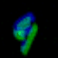

# Time Cell Inspired Temporal Codebook in Spiking Neural Networks for Enhanced Image Generation


**This is the official implementation of "Time Cell Inspired Temporal Codebook in Spiking Neural Networks for Enhanced Image Generation". The GIFs above show the generated event-based NMNIST data**

<p align="center">
  
  
  
  
  
</p>

## Table of Contents

- [Time Cell Inspired Temporal Codebook in Spiking Neural Networks for Enhanced Image Generation](#time-cell-inspired-temporal-codebook-in-spiking-neural-networks-for-enhanced-image-generation)
  - [Table of Contents](#table-of-contents)
  - [Introduction](#introduction)
  - [SetUp](#setup)
  - [Data](#data)
  - [Training](#training)
    - [Default Run](#default-run)
    - [Custom Run and Config](#custom-run-and-config)
  - [Sample](#sample)
    - [Script](#script)
    - [Results](#results)
  - [Acknowledgement](#acknowledgement)
  - [BibTeX](#bibtex)
  - [To-Do](#to-do)
  

## Introduction
This paper presents a novel approach leveraging Spiking Neural Networks (SNNs) to construct a Variational Quantized Autoencoder (VQ-VAE) with a temporal codebook inspired by hippocampal time cells. This design captures and utilizes temporal dependencies, significantly enhancing the generative capabilities of SNNs. Neuroscientific research has identified hippocampal "time cells" that fire sequentially during temporally structured experiences. Our temporal codebook emulates this behavior by triggering the activation of time cell populations based on similarity measures as input stimuli pass through it. We conducted extensive experiments on standard benchmark datasets, including MNIST, FashionMNIST, CIFAR10, CelebA, and downsampled LSUN Bedroom, to validate our model's performance. Furthermore, we evaluated the effectiveness of the temporal codebook on neuromorphic datasets NMNIST and DVS-CIFAR10, and demonstrated the model's capability with high-resolution datasets such as CelebA-HQ, LSUN Bedroom, and LSUN Church. The experimental results indicate that our method consistently outperforms existing SNN-based generative models across multiple datasets, achieving state-of-the-art performance. Notably, our approach excels in generating high-resolution and temporally consistent data, underscoring the crucial role of temporal information in SNN-based generative modeling.

The overview of proposed method is as follows:

<p align="center">
  
</p>

The activation of temporal codebook represents a spatiotemporal trajectory, akin to the activation of time cells, as illustrated below:

<p align="center">
  
</p>


## SetUp
We use 4 x A100 40G to train proposed model.
```
git clone 
cd tts_vqvae
pip install -r requirements.txt
```

## Data
- **LSUN bedroom**: We use only [20% of LSUN bedroom](https://www.kaggle.com/datasets/jhoward/lsun_bedroom)
- **CelebA**: From torchvison [interface](https://pytorch.org/vision/main/generated/torchvision.datasets.CelebA.html)
- **NMNIST**: From [BrainCog](https://github.com/BrainCog-X/Brain-Cog)


## Training

### Default Run

- First stage of LSUN Bedroom
```
chmod +x ./train/stage_1/run_snn_te_bedroom.sh
./train/stage_1/run_snn_te_bedroom.sh
```

- First stage of Celeba
```
chmod +x ./train/stage_1/run_snn_te_celeba.sh
./train/stage_1/run_snn_te_celeba.sh
```

- First stage of NMNIST
```
chmod +x ./train/stage_1/run_snn_te_nmnist.sh
./train/stage_1/run_snn_te_nmnist.sh
```

- Second stage of LSUN Bedroom
```
chmod +x ./train/stage_2/run_snn_transformer_bedroom.sh
./train/stage_2/run_snn_transformer_bedroom.sh
```

- Second stage of CelebA
```
chmod +x ./train/stage_2/run_snn_transformer_celeba.sh
./train/stage_2/run_snn_transformer_celeba.sh
```

- Second stage of NMNIST
```
chmod +x ./train/stage_2/run_snn_transformer_nmnist.sh
./train/stage_2/run_snn_transformer_nmnist.sh
```

### Custom Run and Config
For custom run, you need to modify **.yaml** from **./train** folder. We take **./train/stage_1/snn_te_bedroom.yaml** for example.

This part is the config of meta information, including experiment name, index, seed etc. You could change seed and determine whether resume from checkpoint or not.
```
exp:

  # identifier
  name: snn_te
  index: 'bedroom_256'

  # resume
  is_resume: False
  resume_path: res/snn_te/2/ckpt/last.ckpt

  # seed
  seed: 42
```

This part is the information of model. 
```
model:
  base_learning_rate: 4.5e-6
  target: src.registry.model_registry.snnte_lsunbed
  params:
    # snn setting
    snn_encoder: direct
    snn_decoder: mean
    ...
    ...
    ...
```

This part determines how to load data, please ref to [LightningDataModule](https://lightning.ai/docs/pytorch/stable/data/datamodule.html)
```
data:
  target: src.data.data_module.DataModuleFromConfig
  params:
    batch_size: 4
    num_workers: 8
    train:
      target: src.registry.data_registry.lsun_bedroom_256_20_key
      params:
        data_root: "../dataset/lsun_bedroom_0.2"
        split: full
```

This part is the config of pytorch-lightning, please ref to [LightningTrainer](https://lightning.ai/docs/pytorch/stable/common/trainer.html), [LightningCallbacks](https://lightning.ai/docs/pytorch/stable/extensions/callbacks.html), and [LightningLogging](https://lightning.ai/docs/pytorch/stable/extensions/logging.html).
```
lightning:
  trainer:
    # multigpus settings
    accelerator: 'gpu'
    strategy: 'ddp_find_unused_parameters_true'
    devices: [0,1,2,3]

    # precision, options: 32-true, 16-mixed etc.
    precision: "32-true"
  ...
  ...
  ...
``` 

## Sample
### Script
Sample on static image
```
chmod +x ./sample/run_sample_static.sh
./sample/run_sample_static.sh
```

Sample on event-based data
```
chmod +x ./sample/run_sample_event.sh
./sample/run_sample_event.sh
```

Custom sample config, in **.yaml** of **./sample**
```
sampler:
  target: src.sample.BaseSampler
  params:
    gen_config_path: train/stage_2/snn_transformer_nmnist.yaml
    gen_ckpt_path: res/snn_transformer/nmnist/ckpt/epoch=99-step=46900.ckpt
    batch_size: 64
    code_h: 4
    code_w: 4
    verbose_time: False


sample_params:
  num_samples: 100
  temperature: 1.0
  time_unfold: false
```

Here are some explanations for config above:
- **gen_config_path** is .yaml config of second stage model.
- **gen_ckpt_path** is checkpoint path of second stage model.
- **code_h/code_w** is codebook size, equal to resolution/16
- **time_unfold** determines whether to unfold event data across time step.

### Results

Generated images of resolution $256 \times 256$.


Generated images of resolution $64 \times 64$.


Unfold generated event data, comparing our temporal codebook with vanilla codebook.


## Acknowledgement

- The code in this repo is mainly inspired from this [repo](https://github.com/CompVis/taming-transformers)
- The implementation of FID in this work is from [pytorch-fid](https://github.com/mseitzer/pytorch-fid)
- The implementations of IS, PRC, KID in this work are from [torch-fidelity](https://github.com/toshas/torch-fidelity)

## BibTeX
```
@article{feng2024time,
  title={Time Cell Inspired Temporal Codebook in Spiking Neural Networks for Enhanced Image Generation},
  author={Feng, Linghao and Zhao, Dongcheng and Shen, Sicheng and Dong, Yiting and Shen, Guobin and Zeng, Yi},
  journal={arXiv preprint arXiv:2405.14474},
  year={2024}
}
```
## To-Do

- [x] finish scripts
- [x] debug and run
    1. - [x] bed_256 stage_1
    2. - [x] celeba stage_1
    3. - [x] nmnist stage_1
    4. - [x] bed_256 stage_2
    5. - [x] celeba stage_2
    6. - [x] nmnist stage_2
    7. - [x] sample static
    8. - [x] sample event
- [ ] decorate README.md
    1. - [x] add shield.io badge (arxiv, license, braincog)
    2. - [ ] requirements and URL in Installation
    3. - [x] add event GIF
